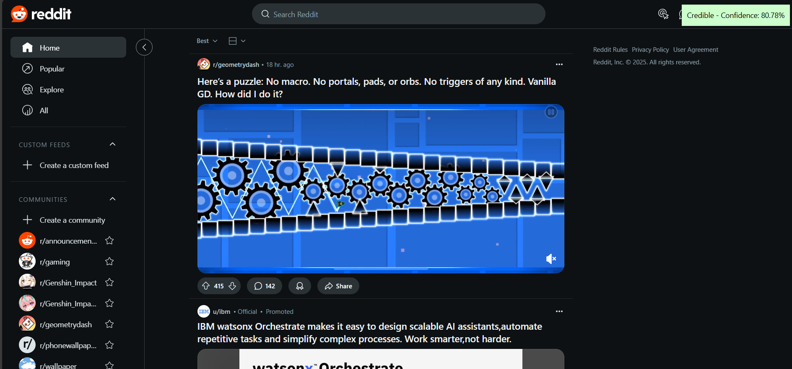

---

# 📰 Fake News & AI Content Detection Extension

## 📌 Overview  
This browser extension detects **fake news**, **AI-generated content**, and **website credibility** in real time. It analyzes website content, X (Twitter) posts, and articles, helping users identify **misinformation**, **plagiarism**, and **phishing risks** with confidence scores.

## 🚀 Features  
- ✅ **Fake News Detection**: Scans articles, blog posts, and X (Twitter) posts to detect fake content.  
- 🤖 **AI Content Detection**: Identifies whether content is human-written or AI-generated (e.g., ChatGPT, Bard).  
- 🔍 **Website Credibility Rating**: Rates websites based on reliability and trustworthiness.  
- 📝 **Plagiarism Detection**: Checks if content is copied from other sources.  
- ⚠️ **Phishing Website Detection**: Warns users about unsafe or suspicious URLs.  
- 🎯 **Confidence Score**: Provides a percentage confidence in the detection results.  

---

## 🏗️ Tech Stack  
- **Frontend**: JavaScript, HTML, CSS  
- **Backend**: Flask (Python), Hugging Face Transformers  
- **Model**: BERT-based model for fake news detection & AI-generated content detection  
- **API Deployment**: Flask API served via Ngrok  

---

## 🔧 Installation  

### Clone the Repository  
```sh
git clone https://github.com/TeamEquinox-05/HackIndia-Spark-3-2025-Equinox.git
```

**Set Up Fake News & Post Detection**
1. **Upload `TruthShield.ipynb` to Google Colab** and follow the instructions.  
2. **Obtain an Ngrok URL** after running the API server in Colab.  
3. **Update `content.js`**:  
   - Replace `FLASK_SERVER_API` in the extension script with your **Ngrok API URL**.  
4. **Load the Extension in Chrome:**  
   - Open `chrome://extensions/`  
   - Enable **Developer Mode**  
   - Click **Load unpacked** and select the extension folder (`fake-news-extension`).  
5. **Test the Extension:**  
   - Open `test.html` to verify functionality.  
   - Works on **X (Twitter) posts** and general **website content detection**.  

   ## 📌 How It Works  
   - The extension **injects a script** into web pages to analyze content.  
   - It sends the extracted text to the Flask server for **AI-based analysis**.  
   - The API returns:  
     - **Label** (`Fake`, `Real`, `AI-Generated`, etc.)  
     - **Confidence Score** (`0-100%`)  
   - Results appear as an **overlay** on the webpage.  

   ## Example Usage  
   
   ### 🔍 Fake News Detection on X (Twitter)  
   - Scans tweets and labels them as **Fake** or **Real**.  
   - Displays an **overlay with a confidence score**.  
   - **Example:**  
       
       
---


**🤖 AI-Generated Content Detection**  
- Detects AI-generated text on **selected website content**.  
- Shows **how likely** content is generated by AI.  
**Example:**  
    
    

---

**⚠️ Phishing Website Detection**
- Analyzes website **URLs** and warns users about **unsafe** websites.  
- Displays **a warning pop-up** for **malicious** sites.  


---

## 📌 Status  
✅ **All individual extensions are functional but need to be integrated into a single extension.**  
⚡ **We ran out of time to combine them but plan to merge them in future updates.**  

---

## 🛠️ Future Enhancements  
🔹 **Multi-language Support**: Detect misinformation in multiple languages.  
📊 **User Dashboard**: Track historical analysis of scanned content.  
🔍 **Fact-Checking Integration**: Connect to verified fact-checking databases.  
🧠 **Model Improvements**: Enhance accuracy with better AI training.  

---

## 🤝 Contributing  
Want to improve this project? Feel free to submit a **pull request** or open an **issue**!  

